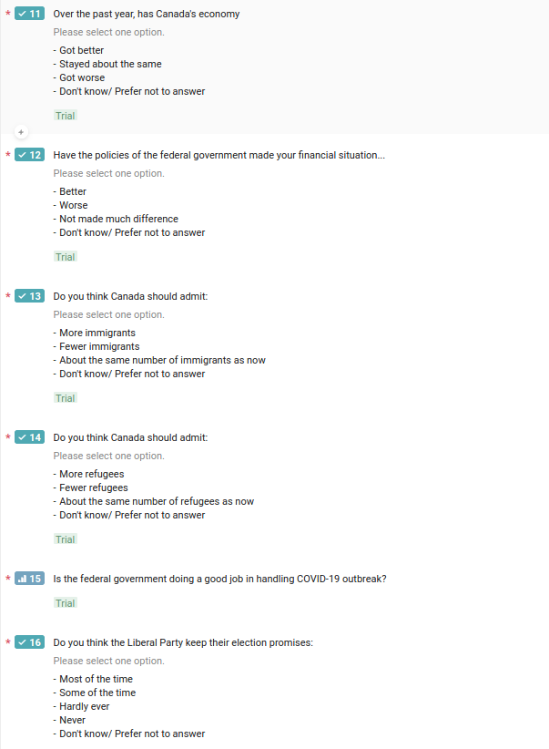

```{r setup, include=FALSE, cache = FALSE}
require("knitr")
opts_chunk$set(tidy.opts=list(width.cutoff=60),tidy=TRUE)
opts_chunk$set(engine = "R")
knitr::opts_chunk$set(echo = T)
knitr::opts_chunk$set(message = F)
knitr::opts_chunk$set(warning = F)
## setting wd in DELL
# opts_knit$set(root.dir = "~/Documents/")
                                                 
## cache = F, if cache = T, will not revaluate code chunk everytime
## double or more space to insert a line break
```


```{r libs, echo = FALSE, warning= F}
######################
## Set up workspace
######################
rm(list = ls())
require(tidyverse)
require(magrittr)
require(forcats)

options(stringsAsFactors = F)
options(dplyr.width = Inf)
# getwd()

# ######## clean memory ######################
# rm(list = ls())
# gc()
# is(dds)
# slotNames(dds)
```

# Executive Summary 


```{r simulationdata, echo = FALSE, include=FALSE, eval= TRUE, warning= FALSE}
#TODO: generate data by sample 
# ?sample
# random seed to make reproducible 
set.seed(666)
n = 200
# simulate data
df <- tibble( Age = round( runif(n, min = 18, max = 98), 0),
              Gender = sample(c("Man", "Woman", "Other"), n, replace = TRUE, 
                              prob = c(0.41, 0.58, 0.01) ),
              Education = sample(c("Elementary", "High", 
                                   "College", "University", "Master", "Doctorate",
                                   "Other"), n, replace = TRUE, 
                              prob = c(0.01, 0.2, 0.31, 0.34, 0.08, 0.04, 0.02) ),    
              Income = sample(c("No", "1 - 30000", 
                                   "30001 - 60000", "60001 - 90000", "90001 - 110000", 
                                "110001 - 150000", "150001 - 200000", "200001 -", "Other"), 
                              n, replace = TRUE, 
                              prob = c(0.017, 0.157, 0.209, 0.159, 
                                       0.084, 0.075, 0.038, 0.024, 0.236) ),  
              Votes_2015 = sample (c("Liberal Party", "Conservative Party",
                                     "NDP",  "Green Party", "People's Party", "Other"), 
                                     n, replace = TRUE, prob = c(0.47, 0.45, 0.06, 0.01, 
                                       0.0, 0.01) ), 
                Votes_2019 = sample (c("Liberal Party", "Conservative Party",
                                     "NDP",  "Green Party", "People's Party", "Other"), 
                                     n, replace = TRUE, prob = c(0.422, 0.447, 0.071, 0.04, 
                                       0.01, 0.01) ),
              MP = sample(c("Strongly agree", "Agree", "Neutral", "Disagree",
                            "Strongly disagree", "Other"), n, replace = TRUE ), 
              JT = sample(c("Very Satisfied", "Satisfied", "Neutral", "Not Satisfied",
                            "Strongly Not Satisfied"), n, replace = TRUE ), 
              Tax = sample(c("Very Satisfied", "Satisfied", "Neutral", "Not Satisfied",
                            "Strongly Not Satisfied"), n, replace = TRUE ),
              Econ = sample(c("Better", "Same", "Worse", "Other"), n, replace = TRUE ), 
              Finance = sample(c("Better", "Same", "Worse", "Other"), n, replace = TRUE ), 
              ImmiJobs = sample(c("Strongly agree", "agree", "Neutral", "disagree",
                            "Strongly disagree"), n, replace = TRUE ),
              Immi = sample(c("More", "Same", "Less", "Other"), n, replace = TRUE ),
              Refu = sample(c("More", "Same", "Less", "Other"), n, replace = TRUE ),
              COVID = sample(c("Very good", "good", "Neutral", "bad",
                            "Very bad"), n, replace = TRUE ),
              Prom = sample(c("Most of the time", "Some of the time", 
                              "Hardly ever", "Never", "Other"), n, replace = TRUE ) )
df %>% sample_n(10)


```

# Introduction
In 2019, the Liberal Party which led by Justin Trudeau, won just 157 seats, compared to 184 seats in 2015. Although the Liberal Party was allowed to form a minority government, both the popular vote and the majority government were lost. Actually, the popular vote decreased by 6.35% to 33.12% in 2019 compared with 2015 (Zimonjic, 2019).  
Toronto has a total of 25 Members of Parliament (MPs). Traditionally, Toronto has always been an vital source of support for the Liberal Party and the Liberals usually dominates the inner portion of the city. In the past two federal elections, the dominance of the Liberals was shaken in three electoral districts, Thornhill, Markham-Unionville and Aurora-Oak Ridges-Richmond Hill (AORRH). Out of those three ridings, the AORRH is the swing riding, where the Liberals was swept by the Conservatives in 2011, then won the next one by just 2.1% and eventually lost the last one by just 2.5% to the Conservatives again (CBC News, 2019). Interestingly, Leona Alleslev who was elected twice as the MP representing the riding of AORRH, crossed the floor to join the Conservative Party from the Liberal Party on September 17, 2018. The results of the last two election indicates that the Liberals has gained support from a significant amount of residents in this district. It is very likely that the Liberals might dominate this riding as well, through a better understanding of the resident profiles and a more accurate targeting.  
Therefore, our campany, Petit Poll, has designed a online survey to target the 90,000 adult residents in the AORRH riding (Statistics Canada, 2016). The questions were developed to obtain basic demographics information of respondents, discover details during changes in votes of the last two elections, track the impact of the economy policies and the opinions on immigrants/refugees. Additionally, the impact of COVID-19 was also taken into considerations. In general, this is a probability sampling survey with a cross-section design. Moreover, monthly updates of this survey can build up a time-series analysis to track the opinions of the respondents on the Liberals. All code will be hosted at https://github.com/Chelsea-Cheng99/STA304/tree/master/ProbSet2 to guarantee reproducibility.     

# Methodology
## Survey methodology
This is a sample survey with a cross-sectional design. The target population for this survey is AORRH residents 18 years of age or older, roughly 90,000. The sampling frame used in this survey is the full list of address. The sample in this study is the respondent in this address. Only one respondent is allowed in an address within the same survey.    
Incentives such as grocery store gift cards will be used to reduce non-response. Particularly, a letter with a five dollar gift card will be mailed to the randomly selected address (simple random sampling without replacement). The respondent will be directed to the online survey with the unique user name and password mailed in the letter. By completing the survey, the respondent will get another five dollar gift card. To protect the privacy, no identifiable personal information will be recorded during the survey. The sample size (completed surveys) will be about 200 to get a good coverage of the population.  
With simple random sampling without replacement, we will have good estimations of population parameters:
$$E(\bar{y} )= \mu_{y}$$
$$Var(\bar{y}) = (1 - n/N)(s^{2}_{y} / n)$$
The confidence interval for $\mu_{y}$:
$$\bar{y} \pm z_{\alpha/2} \sqrt{(1 - n/N)(s^{2}_{y} / n)} $$
Where n is the sample size, N is the population size, $s^{2}_{y} = \frac{1}{(n-1)} \Sigma_{i \in s}(y_i - \bar{y})^{2}$ and the significant level $\alpha$ is 0.05.  
The questionnaire is relatively short and all questions are required to answer. All questions are provided with clear options, including the "other/ prefer not to say" option. The missing values can also replaced with imputation values such as sample mean during the post-survey analysis stage (Toepoel & Schonlau, 2017).     
The total cost to conduct a survey will be about 20,000 dollars.  

## Simulation 
To test the performance of the survey, probability sampling methods were applied to generate the simulated survey results. The results were then demonstrated descriptively. In terms of the simulation, several assumptions were made according to reference datasets: Census 2016 data (Statistics Canada, 2016) and 2019 Canadian Election Study (Stephenson et al., 2019). In general, the underlying distributions or probability mass functions were assumed for different variables. Meanwhile, independence was assumed between questions. The details will be found in the appendix.  


```{r cleandata, echo = FALSE, eval=TRUE}
# choose variables want to use
# Now we have age and total household income  
# Transform data from wide to long 
dfVotes <- df[, c("Votes_2015", "Votes_2019")]

# dim(df)
# head(df)
```


```{r makeGraph, echo = FALSE}
fontSize <- 14
p1<-ggplot(data=df, aes(Gender)) +
  geom_bar(aes(fill=Gender), stat="count", color="black", width = 0.5) +
  labs(y = "Count",
       title = "Gender Distribution: the Aurora-Oak Ridges-Richmond Hill riding") + 
  scale_fill_brewer() +
  # scale_fill_brewer(type = "div", palette = "RdBu") +
  theme_bw() +
theme(axis.text.x = element_text(size = fontSize -2, colour = "black"),
      axis.text.y = element_text(size = fontSize - 2, colour = "black"),
      axis.title.x = element_text(size = fontSize),
      axis.title.y = element_text(size = fontSize),
      legend.text = element_text(size= fontSize - 2),
      legend.title = element_text(size= fontSize))
p1


fontSize <- 14
p2<-ggplot(data=df, aes(Votes_2015)) +
  geom_bar(aes(fill=Votes_2015), stat="count", color="black", width = 0.5) +
  labs(y = "Count",
       title = "Gender Distribution: the Aurora-Oak Ridges-Richmond Hill riding") + 
  scale_fill_brewer() +
  # scale_fill_brewer(type = "div", palette = "RdBu") +
  theme_bw() +
theme(axis.text.x = element_text(size = fontSize -2, colour = "black"),
      axis.text.y = element_text(size = fontSize - 2, colour = "black"),
      axis.title.x = element_text(size = fontSize),
      axis.title.y = element_text(size = fontSize),
      legend.text = element_text(size= fontSize - 2),
      legend.title = element_text(size= fontSize))
p2


```

# Introduction
To ensure a strong sampling frame, to get a good probability based coverage of the population. To make sure a roughly equal opportunity to be sampled, use a list of every registered address in the country. Stick with probability-based sampling, and not paying respondents.  

A probability sampling method is any method of sampling that utilizes some form of random selection. In order to have a random selection method, you must set up some process or procedure that assures that the different units in your population have equal probabilities of being chosen.  
- Simple random sampling
- Stratified random sampling
- Cluster sampling
- Systematic sampling: draw a sample by selecting individuals systematically from a list or line, such as select every 10th person on a class list.   


# Background
Decrements in aspects such as trust in politicians, satisfaction with democracy

# Survey Methodology
Probability Sampling Techniques.  
1. Identify sampling frame, which is the complete list of all cases in the population from which your sample will be drawn.  
2. Decide on sample size, better have large population and sample size.  
Decide on confidence level, 95%.  
Margin of error, which is the confidence interval.  
3. Choose sampling technique


# Results  


# Appendix 
## The survey
The first 10 questions can be found at https://chelsea942995612.typeform.com/to/yCpsK2tR.  



## The simulated results

The following code was used to generate the simulated data. 


```{r codeSim, echo=TRUE, eval=FALSE}
# random seed to make reproducible 
set.seed(666)
# simulate data
df <- tibble( Age = round( runif(n, min = 18, max = 98), 0),
              Gender = sample(c("Man", "Woman", "Other"), n, replace = TRUE, 
                              prob = c(0.41, 0.58, 0.01) ),
              Education = sample(c("Elementary", "High", 
                                   "College", "University", "Master", "Doctorate",
                                   "Other"), n, replace = TRUE, 
                              prob = c(0.01, 0.2, 0.31, 0.34, 0.08, 0.04, 0.02) ),    
              Income = sample(c("No", "1 - 30000", 
                                   "30001 - 60000", "60001 - 90000", "90001 - 110000", 
                                "110001 - 150000", "150001 - 200000", "200001 -", "Other"), 
                              n, replace = TRUE, 
                              prob = c(0.017, 0.157, 0.209, 0.159, 
                                       0.084, 0.075, 0.038, 0.024, 0.236) ),  
              Votes_2015 = sample (c("Liberal Party", "Conservative Party",
                                     "NDP",  "Green Party", "People's Party", "Other"), 
                                     n, replace = TRUE, prob = c(0.47, 0.45, 0.06, 0.01, 
                                       0.0, 0.01) ), 
                Votes_2019 = sample (c("Liberal Party", "Conservative Party",
                                     "NDP",  "Green Party", "People's Party", "Other"), 
                                     n, replace = TRUE, prob = c(0.422, 0.447, 0.071, 0.04, 
                                       0.01, 0.01) ),
              MP = sample(c("Strongly agree", "Agree", "Neutral", "Disagree",
                            "Strongly disagree", "Other"), n, replace = TRUE ), 
              JT = sample(c("Very Satisfied", "Satisfied", "Neutral", "Not Satisfied",
                            "Strongly Not Satisfied"), n, replace = TRUE ), 
              Tax = sample(c("Very Satisfied", "Satisfied", "Neutral", "Not Satisfied",
                            "Strongly Not Satisfied"), n, replace = TRUE ),
              Econ = sample(c("Better", "Same", "Worse", "Other"), n, replace = TRUE ), 
              Finance = sample(c("Better", "Same", "Worse", "Other"), n, replace = TRUE ), 
              ImmiJobs = sample(c("Strongly agree", "agree", "Neutral", "disagree",
                            "Strongly disagree"), n, replace = TRUE ),
              Immi = sample(c("More", "Same", "Less", "Other"), n, replace = TRUE ),
              Refu = sample(c("More", "Same", "Less", "Other"), n, replace = TRUE ),
              COVID = sample(c("Very good", "good", "Neutral", "bad",
                            "Very bad"), n, replace = TRUE ),
              Prom = sample(c("Most of the time", "Some of the time", 
                              "Hardly ever", "Never", "Other"), n, replace = TRUE ) )
```

## References
CBC News. "Canada Votes 2019". https://newsinteractives.cbc.ca/elections/federal/2019/results/. 2019.  

CBC News. "Canada Votes 2015". https://www.cbc.ca/news2/interactives/results-2015/. 2015.  

Statistics Canada. "Census Profile, 2016 Census". https://www12.statcan.gc.ca/census-recensement/2016/dp-pd/prof/details/page.cfm?Lang=E&Geo1=FED&Code1=35003&Geo2=PR&Code2=35&SearchText=aurora&SearchType=Begins&SearchPR=01&B1=All&TABID=1&type=0. 2016.  

Stephenson, Laura, Allison Harrel, Daniel Rubenson and Peter Loewen. Forthcoming. 'Measuring Preferences and Behaviour in the 2019 Canadian Election Study,' Canadian Journal of Political Science.  

Vera Toepoel & Matthias Schonlau. Dealing with nonresponse: Strategies to increase participation and methods for postsurvey adjustments, Mathematical Population Studies, 24:2, 79-83, 2017.  

Zimonjic, Peter. "Liberals take losses but win enough in Quebec and Ontario to form minority government". Canadian Broadcasting Corporation. Retrieved October 21, 2019.  


